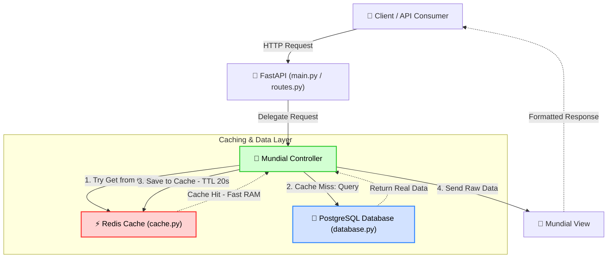

# Redis Bypass Laboratory

A modern, high-performance microservice demonstration showcasing the **Cache-Aside** architectural pattern using **FastAPI**, **Redis**, and a simulated **PostgreSQL** database. The project is structured using the **Model-View-Controller (MVC)** design pattern to ensure clean separation of concerns, scalability, and ease of testing.

---

## 🏗️ Architecture Overview

This project implements the **MVC (Model-View-Controller)** pattern alongside a robust caching mechanism:
*   **Routes (`app/routes.py`)**: Exposes public REST endpoints and handles initial request routing.
*   **Controllers (`app/controllers/`)**: Manages the business logic and orchestrates data retrieval, utilizing the Cache-Aside pattern.
*   **Models (`app/models/`)**: Handles data schemas (via Pydantic) and data access layers (Redis Cache and simulated PostgreSQL database).
*   **Views (`app/views/`)**: Formats and structures response data for the API clients.

### Architectural Diagram



<p align="center">
  
</p>

---

## ⚡ Caching Strategy (Cache-Aside)

The **Cache-Aside** (or Lazy Loading) flow implemented in [mundial_controller.py](file:///c:/Users/matia/OneDrive/Desktop/apps/redis-bypass/app/controllers/mundial_controller.py) operates as follows:

1.  **Read Request**:
    *   The client requests the list of World Cup tournaments.
    *   The controller queries the Redis cache using the key `data:mundiales`.
    *   **Cache Hit**: If data is present in Redis, it is returned instantly from RAM.
    *   **Cache Miss**: If Redis is empty or the key has expired:
        1.  The controller queries the primary PostgreSQL database (which simulates a heavy disk operation with a 3-second delay).
        2.  The controller saves the retrieved database records into Redis with a **20-second TTL** (Time To Live).
        3.  The controller formats and returns the data to the client.
2.  **Write / Cache Invalidation**:
    *   To prevent stale data, a manual invalidation endpoint (`POST /api/v1/mundiales/invalidar`) is provided to clear the cached key.
    *   Adding a new championship (`POST /api/v1/mundiales/add_championship`) will save the new record to the database and automatically invalidate the cache to guarantee consistency on the next read.

---

## 🛠️ Technology Stack

*   **Runtime & Framework**: [Python 3.10+](https://www.python.org/) / [FastAPI](https://fastapi.tiangolo.com/) (High-performance ASGI framework)
*   **Cache Store**: [Redis](https://redis.io/) (In-memory data store)
*   **Server**: [Uvicorn](https://www.uvicorn.org/) (Asynchronous server implementation)
*   **Schemas & Type Validation**: [Pydantic v2](https://docs.pydantic.dev/)
*   **Static Analysis & Types**: [Pyright](https://github.com/microsoft/pyright)

---

## 🚀 Getting Started

### Prerequisites

Make sure you have a local instance of Redis running on port `6379`. If you are using Docker, you can start one instantly:
```bash
docker run --name redis-cache -p 6379:6379 -d redis
```

### Setup & Installation

1.  **Clone the repository and navigate to the project directory:**
    ```powershell
    cd c:\Users\matia\OneDrive\Desktop\apps\redis-bypass
    ```

2.  **Activate the Virtual Environment:**
    *   **PowerShell**:
        ```powershell
        .venv\Scripts\Activate.ps1
        ```
    *   **Command Prompt (CMD)**:
        ```cmd
        .venv\Scripts\activate.bat
        ```

3.  **Install dependencies (if not already installed):**
    ```bash
    pip install -r requirements.txt
    ```

4.  **Run the Server:**
    ```bash
    uvicorn main:app --reload
    ```

---

## 🌐 API Reference

Once the server is running, the interactive documentation is available at [http://localhost:8000/docs](http://localhost:8000/docs).

### Endpoints

| Method | Endpoint | Description |
| :--- | :--- | :--- |
| `GET` | `/api/v1/mundiales` | Retrieves the list of World Cup tournaments (Cache-Aside enabled). |
| `POST` | `/api/v1/mundiales/add_championship` | Adds a new World Cup championship and invalidates the Redis cache. |
| `POST` | `/api/v1/mundiales/invalidar` | Manually deletes the World Cup data from Redis cache. |
| `GET` | `/health` | Verifies the operational status of the microservice. |

---

## 📊 Logging & Observability

This application contains a custom HTTP logging interceptor (FastAPI middleware) that prints request lifecycle information to standard output in the following format:
`[date] | [level] | [endpoint] | [method] | [message]`

### Sample Logs

*   **Cache Miss Flow**:
    ```text
    2026-06-18 22:25:16 | INFO | /api/v1/mundiales | GET | Request started
    2026-06-18 22:25:16 | INFO | Controller: Fetching championships...
    2026-06-18 22:25:16 | INFO | Redis GET: Querying key 'data:mundiales'
    2026-06-18 22:25:16 | INFO | Redis CACHE MISS: Key 'data:mundiales' not found
    2026-06-18 22:25:16 | INFO | Controller: Cache miss. Directing query to simulated PostgreSQL database...
    2026-06-18 22:25:19 | INFO | Redis SET: Storing key 'data:mundiales' with TTL 20 seconds
    2026-06-18 22:25:19 | INFO | Redis SET Success: Key 'data:mundiales' stored successfully
    2026-06-18 22:25:19 | INFO | Controller: Returning database results and updating cache.
    2026-06-18 22:25:19 | INFO | /api/v1/mundiales | GET | Request completed in 3022.95 ms
    ```

*   **Cache Hit Flow**:
    ```text
    2026-06-18 22:25:20 | INFO | /api/v1/mundiales | GET | Request started
    2026-06-18 22:25:20 | INFO | Controller: Fetching championships...
    2026-06-18 22:25:20 | INFO | Redis GET: Querying key 'data:mundiales'
    2026-06-18 22:25:20 | INFO | Redis CACHE HIT: Key 'data:mundiales' found
    2026-06-18 22:25:20 | INFO | Controller: Cache hit. Rendering response from Cache.
    2026-06-18 22:25:20 | INFO | /api/v1/mundiales | GET | Request completed in 2.50 ms
    ```
